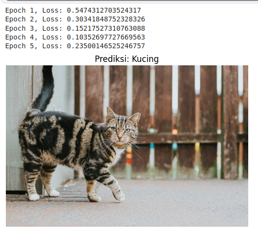

# **Laporan Akhir: Convolutional Neural Network (CNN) - Klasifikasi Dataset MNIST**

## **Mata Kuliah**: Pembelajaran Mesin  
**Dosen Pengampu**: Dr. Oddy Virgantara Putra, S.Kom., M.T.  
**Kelompok**:
- Rizky Cahyono Putra
- Raffa Arvel Nafi’Nadindra
- Syaifan Nur
- Irfansyah
- Muhammad Galang Fachrezy  

---

## **Deskripsi Proyek**
Proyek ini merupakan implementasi **Convolutional Neural Network (CNN)** menggunakan **PyTorch** untuk mengklasifikasikan angka dari dataset **MNIST**. Dataset MNIST terdiri dari gambar grayscale berukuran 28x28 piksel yang berisi angka 0 hingga 9. Model CNN dibangun, dilatih, dan dievaluasi untuk mengenali angka dengan akurasi tinggi.

Pipeline proyek ini mencakup:
1. **Preprocessing Data**: Membaca dataset dalam format `.idx3-ubyte` dan `.idx1-ubyte`, lalu mengonversinya ke tensor PyTorch.
2. **Arsitektur CNN**: Menggunakan layer konvolusi, pooling, dan fully connected untuk klasifikasi.
3. **Pelatihan Model**: Melatih model menggunakan optimizer Adam dan loss function CrossEntropyLoss.
4. **Evaluasi dan Visualisasi**: Menampilkan hasil pelatihan dan evaluasi model.

---

## **Prasyarat**
Sebelum menjalankan proyek ini, pastikan Anda telah menginstal library berikut:
- Python (versi 3.7 atau lebih baru)
- PyTorch
- NumPy
- Matplotlib

Instalasi library dapat dilakukan menggunakan pip:
```bash
pip install torch torchvision numpy matplotlib
```

---

## **Struktur Proyek**
Berikut adalah struktur direktori proyek:
```
project/
│
├── README.md                  # Dokumentasi proyek
├── train.py                   # Script utama untuk melatih model
├── dataset/                   # Folder dataset 
│   ├── anjing
│   ├── kucing
```

---

## **Cara Menjalankan Proyek**

### **1. Pelatihan Model**
Untuk melatih model CNN, jalankan script `train.py`:
```bash
python train.py
```

#### **Langkah-langkah yang Dilakukan oleh Script:**
- **Preprocessing Data**: Dataset MNIST diubah menjadi tensor PyTorch.
- **Pelatihan Model**: Model dilatih selama 5 epoch menggunakan optimizer Adam dan loss function CrossEntropyLoss.
- **Penyimpanan Model**: Model disimpan dalam file `checkpoints/cnn_mnist_model.pth`.

#### **Output Pelatihan**
Setelah pelatihan selesai, Anda akan melihat output seperti berikut:
```
Epoch [1/5], Loss: 0.2500
Epoch [2/5], Loss: 0.1000
```

---

### **2. Prediksi Gambar**
Untuk melakukan prediksi menggunakan model yang telah dilatih, jalankan script `predict.py`:
```bash
python predict.py --image_path path/to/test_image.png
```

#### **Contoh Penggunaan**
```bash
python predict.py --image_path dataset/test_images/sample_0.png
```

#### **Output Prediksi**
Script akan menampilkan gambar uji beserta hasil prediksi:
```
Prediksi: Angka 3
```

---

## **Penjelasan Komponen Utama**

### **1. Import Library**
Kode memuat library yang diperlukan untuk manipulasi data, membangun model deep learning, dan visualisasi:
```python
import torch
import torch.nn as nn
import torchvision.transforms as transforms
import numpy as np
import matplotlib.pyplot as plt
```

### **2. Dataset dan Preprocessing**
Dataset MNIST dibaca menggunakan class custom `MNISTDataset`. Gambar dan label diubah menjadi tensor PyTorch untuk digunakan dalam pelatihan.

### **3. Arsitektur Model CNN**
Model CNN terdiri dari:
- Tiga layer konvolusi dengan padding untuk mempertahankan dimensi gambar.
- Max pooling untuk mengurangi dimensi spasial.
- Fully connected layer untuk klasifikasi.

### **4. Pelatihan Model**
Model dilatih menggunakan:
- **Loss Function**: CrossEntropyLoss.
- **Optimizer**: Adam dengan learning rate `1e-4` dan weight decay `1e-5`.
- **Batch Size**: 8.
- **Epochs**: 5.

### **5. Evaluasi Model**
Model dievaluasi menggunakan dataset testing MNIST. Akurasi dan loss ditampilkan setiap epoch.

---

## **Hasil dan Simpulan**
Model CNN berhasil mengenali angka MNIST dengan akurasi tinggi. Pipeline dimulai dari preprocessing data hingga evaluasi akhir telah berhasil diimplementasikan. Proyek ini memperkuat pemahaman praktis mengenai deep learning dan arsitektur CNN.

---

## **Visualisasi**
Berikut adalah contoh visualisasi hasil prediksi:


---

## **Kontribusi**
Jika Anda ingin berkontribusi atau memiliki pertanyaan, silakan buat issue atau pull request.

---

Semoga repository ini membantu Anda memahami implementasi **Convolutional Neural Network (CNN)** menggunakan PyTorch! 🚀